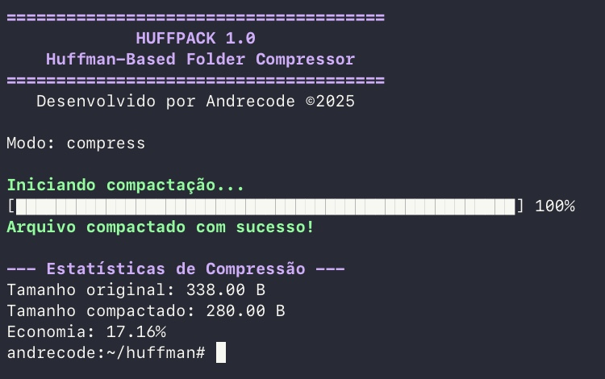

# Huffman C

Implementação simples do algoritmo de compressão de Huffman em C

## Interface no terminal



## Compilação

```bash
gcc -std=gnu99 main.c huffman.c stats.c help.c header.c -o huffman
```

## Uso

```bash
./huffman compress entrada.txt texto_compactado.huff
./huffman decompress texto_compactado.huff texto_descompactado.txt
```
## Como contribuir

Se quiser ajudar a melhorar o projeto, corrigir bugs ou adicionar recursos, será muito bem-vindo!  

Para contribuir:

1. Faça um fork deste repositório.
2. Crie uma branch com sua feature ou correção (`git checkout -b minha-feature`).

---

Obrigado pelo interesse e bora codar! 🚀
